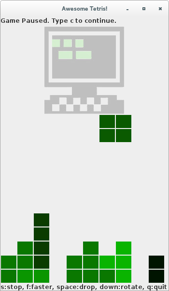

# 🍕Tetris Awesome 🍕

A Tetris Game in Java.

This game is composed of three classes:

Tetris.java
-----------

This is the main class. It extends from JFrame to create the board layout. It also has a method to control the status bar.

The Game is started calling the method start() from the class Board.java.

Shape.java
----------

This class define the seven types of pieces (using enum).

The way we do this is making a map of coordinates for each
piece (remember, each piece has 4 square, i.e. 4 sets of
{x,y} coordinates).

We also define a "NoShape" piece which is filled with zero.
In the Board class, we use this class to fill the game board.

The method setRandomShape() is a pseudo-random function to select a number from 1 to 7. This number defines the next piece in the game.

The method setShape() gets this pseudo-random value for the shape and set the current pieces with the coordinates of this shape.

The methods minY() and minX() make sure the pieces don't go beyond the wall.

The method rotate() inverts the coordinates for a clockwise rotation:

     *  Every time you move the piece, you are actually creating
     *  a new pice in the new coordinates
     *
     *  Rotating is the same as inverting all X to be Y and vice versa
     *
     *  For example, if we hava a L:
     *    L: { { 0, 1 }, { 0, 0 },  { 0, -1 },   { 1, -1 } }
     *                       2
     *                       |
     *                       X          X
     *                       |
     *               --2--1--X--1--2----  or    X
     *                       |
     *                       X  X       X  X
     *                       |
     *                       2
     *
     *  In coord array [i][j], i defines the four {x,y} and j the values for x or y
     *  If we rotate once, for each idx from 1 to 4:
     *     setX(idx, - x) --> coords[idx][0] = x
     *         where x is getY(idx) --> coords[idx][1]
     *  (and same for setY but without -).
     *
     *  So the new coordinates become:
     *         { -1, 0 }, { 0, 0 },  { 1, 0 },   { 1, 1 }
     *                       2
     *                       |
     *                       1  X
     *                       |              X
     *               --2--X--X--X--2----   or   X  X  X
     *                       |
     *                       1
     *                       |
     *                       2
     *
     *  Rotating once more:
     *         { 0, -1 }, { 0, 0 },  { 0, 1 },   { -1, 1 }
     *                       2
     *                       |
     *                    X  X
     *                       |           X  X
     *               --2--1--X--1--2----   or     X
     *                       |            X
     *                       X
     *                       |
     *                       2
     *
     *  Rotating once more:
     *         { 1, 0 }, { 0, 0 },  { -1, 0 },   { -1, -1 }
     *                       2
     *                       |
     *                       1
     *                       |
     *               --2--X--X--X--2----   or     X X X
     *                       |            X
     *                    X  1
     *                       |
     *                       2
     *
     *  Rotating once more we return to the origin:
     *         { 0, 1 }, { 0, 0 },  { 0, -1 },   { 1, -1 }
     *                       2
     *                       |
     *                       X
     *                       |              X
     *               --2--1--X--1--2----   or     X
     *                       |            X X
     *                       X  X
     *                       |
     *                       2
     *
     *   what would happen if we did not inverted with -?
     *
     *  Using the same example for L, we would have:
     *         { 1, 0 }, { 0, 0 },  { -1, 0 },   { -1, 1 }
     *                       2
     *                       |
     *                    X  1
     *                       |             X
     *               --2--X--X--X--2----   or    X X X
     *                       |
     *                       1
     *                       |
     *                       2
     *
     *    We would invert the PARITY!!!!

Finally, we define set and get methods for shape and coordinates x and y.

Board.Java
----------

This class extends from JPanel and implements ActionListener. It contains all the dynamics of the game.

The Board function receives a Tetris object, set the game speed (timer), clear the board and listen for keyboard inputs.

The method getKeys() is basically the menu, it has a case for all the possible keys in the game.

The method actionPerfomed() just moves the block until the bottom. Once the bottom is reached, it releases a new piece.

The methods start(), pause(), restart() control the state of the game.

The method clearBoard() fills the board with 0 (noShape) pieces, cleaning the board.

The method deleteLines() is really clever. First, it creates a counter for the number of lines that are full. Then, starting from the bottom of the board,  it checks horizontally if there is a 0 (no shape). In this case, it returns. If no 0s were found, the line is full and it's time to clean it and add the points. To do this, it gets the shape of the pieces from the method getShapeHere() and add one coordinate in the width.

The method newPiece() controls the release of a new piece. First, it gets a random shape, then it defines the start position (in the middle of width and in the begin of height). Then, it calls the method tryToMove(), to see if it's game over.

The method pieceDropped() is what happens when the piece reaches the bottom. It adds the values of the piece to the array that had all the dropped pieces so far. Then it calls the previous deleteLines() and newPiece() methods.

The method moveDownOneLine() sets the piece's moving by first calling tryToMove(). The method dropPieceDown() makes the piece drop to the bottom.In both cases, if the piece can't move, it calls method pieceDropped().

The methods squareWidth() and squareHeight() returns the dimensions for the squares, directly from Java's super class Graphics.

The method getShapeHere() gets the information from the board array, with all the pieces already dropped. Remember this is a 1D-array.

The method paint() is an implementation of the super class, graphics. Note that you need to use the same name as the super class. We use the methods from the graphics class to first paint all the pieces already dropped and then paint the piece that is falling. It calls the method paintColors() to actually paint the squares with the desired colors.

---------------------------------------------------------

Disclaimer: This was my project in my first week at Hacker School.
